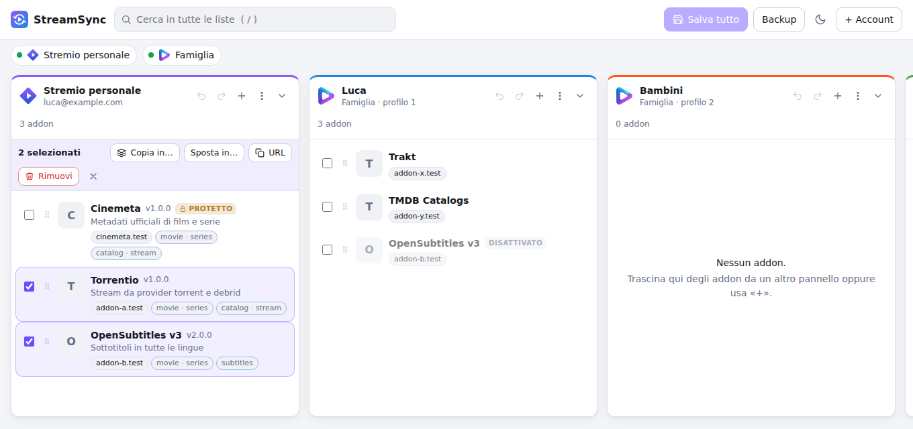

<p align="center">
  
</p>

<h1 align="center">StreamSync</h1>

<p align="center">
  Gestisci da un'unica pagina gli addon di più account <b>Stremio</b> e <b>Nuvio</b>:<br>
  riordinali, aggiornali, copiali da un account all'altro con un trascinamento.
</p>

<p align="center">
  <a href="https://addonmanager.pages.dev/"><b>addonmanager.pages.dev</b></a>
</p>

<p align="center">
  
</p>

---

StreamSync è un'applicazione web statica, senza backend: il browser comunica direttamente con le API ufficiali di Stremio e Nuvio. Le password non vengono mai salvate e non transitano da server di terze parti.

> [!NOTE]
> Progetto indipendente, non affiliato né approvato da Stremio o Nuvio.

## Funzionalità

**Account**
- Più account Stremio e Nuvio aperti insieme, affiancati in colonne.
- Account Nuvio con profili: una colonna per profilo (fino a 6). I profili che usano gli addon del Profilo 1 sono in sola lettura.

**Organizzazione degli addon**
- **Trascina e rilascia** (da computer) per riordinare una lista o per **copiare** addon in un altro account; tieni premuto <kbd>Maiusc</kbd> mentre rilasci per **spostarli**.
- Scorrimento automatico vicino ai bordi, per raggiungere colonne fuori schermo durante il trascinamento.
- Selezione multipla (con <kbd>Maiusc</kbd>+clic per un intervallo) e azioni di gruppo: copia, sposta, rimuovi, attiva/disattiva (Nuvio).
- Da smartphone e tablet: menu ⋯ → «Copia in…» / «Sposta in…» e frecce ↑ ↓ per riordinare ([vedi sotto](#da-smartphone-e-tablet)). I testi dell'interfaccia si adattano al dispositivo: istruzioni per mouse e tastiera su computer, per il tocco su telefono.
- Ricerca istantanea su tutte le liste e ordinamento alfabetico.

**Manifest e manutenzione**
- Copia l'URL del manifest, il link `stremio://` o il manifest JSON completo, oppure tutti gli URL di una lista.
- Apri il manifest o la pagina di configurazione dell'addon.
- **Verifica e aggiorna**: scarica di nuovo i manifest e segnala gli addon non raggiungibili. Su Stremio i manifest cambiati vengono aggiornati nella bozza, con l'indicazione della versione (`2.0.0 → 3.0.0`).
- Aggiunta da URL (uno o più, anche `stremio://`) con verifica del manifest, oppure trascinando un link da un'altra pagina.

**Bozza, backup e sincronizzazione**
- Ogni modifica resta una **bozza locale**, con annulla/ripeti, finché non premi «Salva». Un riepilogo (`+2 −1 ~1 ↕`) mostra cosa cambierà.
- **Sincronizza da…**: copia in una lista gli addon mancanti di un'altra, oppure rendila identica alla sorgente, con anteprima.
- Importazione ed esportazione in JSON; backup automatico dello stato remoto prima di ogni salvataggio.
- Tema chiaro e scuro; interfaccia pensata anche per lo smartphone.

## Guida rapida

1. Apri [addonmanager.pages.dev](https://addonmanager.pages.dev/) e premi **+ Account**.
2. Scegli Stremio o Nuvio e accedi con email e password. Attiva «Ricordami» solo su un dispositivo personale.
3. Organizza gli addon: copiali tra gli account, riordinali, aggiungili da URL. Finché non salvi, nulla cambia sui server.
4. Premi **Salva** sulla colonna (o **Salva tutto**). Se rimuovi addon, ti viene chiesta una conferma con l'elenco.

### Scorciatoie da tastiera (computer)

| Tasti | Azione |
|---|---|
| <kbd>/</kbd> | Cerca in tutte le liste (<kbd>Esc</kbd> per azzerare) |
| <kbd>Ctrl</kbd>/<kbd>⌘</kbd> + <kbd>Z</kbd> | Annulla nella colonna attiva |
| <kbd>Ctrl</kbd>/<kbd>⌘</kbd> + <kbd>Maiusc</kbd> + <kbd>Z</kbd> | Ripeti |
| <kbd>Ctrl</kbd>/<kbd>⌘</kbd> + <kbd>S</kbd> | Salva la colonna attiva |
| <kbd>↑</kbd> / <kbd>↓</kbd> | Spostati tra gli addon |
| <kbd>Alt</kbd> + <kbd>↑</kbd> / <kbd>↓</kbd> | Sposta in su / in giù l'addon con il focus |
| <kbd>Spazio</kbd> | Seleziona / deseleziona |
| <kbd>Canc</kbd> | Rimuovi (dalla bozza) |

### Da smartphone e tablet

Sugli schermi stretti i pannelli sono uno sotto l'altro e **scorre solo la pagina**: puoi far scorrere il dito ovunque, anche sopra una lista, senza che la lista "catturi" il gesto. L'intestazione di ogni pannello (nome, riepilogo delle modifiche, «Salva», azioni sulla selezione) resta agganciata in alto mentre scorri i suoi addon.

- **Copiare o spostare:** tocca ⋯ accanto all'addon → «Copia in…» o «Sposta in…» → scegli l'account o il profilo.
- **Più addon insieme:** spunta le caselle, poi usa «Copia» / «Sposta» nella barra che compare in alto.
- **Riordinare:** frecce ↑ ↓ accanto a ogni addon.
- **Ripiegare una lista:** la freccia in alto a destra del pannello.

Il trascinamento con il dito non è previsto: su touch si usa il menu ⋯.

## Sicurezza e privacy

- **Credenziali.** La password serve solo a ottenere un token di sessione e non viene mai memorizzata. Il token viene conservato:
  - con «Ricordami» spento (impostazione predefinita) in `sessionStorage`, cioè finché la scheda resta aperta;
  - con «Ricordami» attivo in `localStorage`, anche dopo la chiusura del browser.
- **Revoca.** Il token Stremio non scade da solo. *Backup → «Esci da tutto e cancella i dati locali»* lo invalida sul server e cancella ogni dato salvato nel browser. La disconnessione da Nuvio usa `scope=local`, così le altre app restano collegate.
- **Isolamento.** L'app è pubblicata su un dominio dedicato, con intestazioni HTTP di sicurezza:
  - Content-Security-Policy restrittiva, con Trusted Types e `frame-ancestors 'none'`;
  - `X-Frame-Options`, `nosniff`, HSTS, `no-referrer`.
- **Dati non fidati.** Nomi, descrizioni e loghi degli addon vengono trattati come testo non fidato, anche quando il manifest è malformato. Nessun `innerHTML` con dati esterni.
- **Nessun tracciamento.** Non ci sono analytics, cookie o risorse di terze parti: loghi e font sono locali o di sistema.
- **URL degli addon.** Spesso contengono chiavi personali (per esempio `realdebrid=…`). Backup, esportazioni e «Copia tutti gli URL» le includono: trattali come dati riservati. Gli URL vengono salvati esattamente come sono stati inseriti, senza ricodifiche.

## Integrità dei dati

Le API di Stremio (`addonCollectionSet`) e Nuvio (`sync_push_addons`) sostituiscono **l'intera lista** a ogni salvataggio. StreamSync è progettato perché questo non porti a perdite:

- **Conferma esplicita** prima di rimuovere addon; nei dialoghi distruttivi <kbd>Invio</kbd> seleziona l'azione sicura.
- **Rilevamento dei conflitti.** Se la lista è stata modificata su un altro dispositivo, puoi unire le modifiche (predefinito), ricaricare o sovrascrivere.
- **Unione a tre vie.** L'unione conserva le modifiche di entrambe le parti. Gli addon che non hai toccato prendono la versione attuale del server.
- **Campi conservati.** I campi del descrittore Stremio che l'app non gestisce vengono mantenuti.
- **Backup automatico** dello stato remoto prima di ogni scrittura: ultimi 25, eliminati insieme all'account.
- **Verifica dopo la scrittura.** Dopo il salvataggio la lista viene riletta; dopo un timeout si verifica se la scrittura è comunque avvenuta.
- **Ordine di «Salva tutto».** Prima vengono salvate le liste che ricevono addon, poi quelle che li perdono: uno spostamento interrotto lascia un duplicato, mai una perdita.

## Limitazioni note

- **Verifica dei manifest.** Il browser non distingue un server offline da uno che non consente richieste cross-origin. Su Nuvio un addon non verificabile si può aggiungere comunque, perché basta l'URL. Su Stremio serve il manifest completo, quindi non si può.
- **URL `http://`.** Vengono bloccati dal browser, perché la pagina è servita in HTTPS (fa eccezione `localhost`).
- **Addon protetti di Stremio** (per esempio Cinemeta): non si possono rimuovere.
- **Accesso a Stremio.** Solo con email e password; gli accessi tramite Facebook o Apple non sono supportati.
- **Manifest su Nuvio.** Il server non conserva il manifest, quindi «aggiorna» si limita al nome e allo stato dell'addon.

## Architettura

Applicazione statica in JavaScript moderno (moduli ES), senza framework né dipendenze di runtime.

| Servizio | Endpoint utilizzati |
|---|---|
| Stremio — `api.strem.io` | `login`, `logout`, `addonCollectionGet`, `addonCollectionSet` |
| Nuvio — `api.nuvio.tv` | `auth/v1/token` (accesso e rinnovo), `auth/v1/logout`, `rest/v1/addons`, RPC `sync_pull_profiles` e `sync_push_addons` |

Entrambe le API consentono richieste cross-origin, quindi non serve alcun proxy. Per Nuvio si usa la chiave pubblica ("publishable key") indicata nella documentazione ufficiale.

```
index.html, css/, img/     interfaccia, stili, loghi
js/util.js                 URL, hashing, concorrenza (senza DOM)
js/stremio.js, nuvio.js    client delle API
js/manifest.js             download e validazione dei manifest
js/model.js                bozza, annulla/ripeti, diff, unione a tre vie
js/convert.js, backup.js   conversione tra servizi, import/export
js/store.js                persistenza locale
js/app.js                  controller: account, caricamento, salvataggio, copia
js/ui/                     componenti dell'interfaccia
_headers                   intestazioni HTTP (Cloudflare Pages)
redirect/                  pagina di reindirizzamento del vecchio indirizzo
scripts/serve.mjs          server di sviluppo
tests/                     test unitari ed end-to-end
```

## Sviluppo

Requisiti: Node.js 22 o superiore. Non ci sono dipendenze da installare.

```bash
npm start          # server locale su http://localhost:8080
npm test           # test unitari
npm run build      # test unitari + copia dei soli file pubblicabili in _site/
```

I test end-to-end usano Playwright con Chromium e simulano le API di Stremio, Nuvio e degli addon:

```bash
npm install --no-save playwright@1.56.1
npx playwright install chromium
npm run test:e2e
```

> [!IMPORTANT]
> I test end-to-end usano server simulati costruiti sulla documentazione ufficiale: non vengono eseguiti contro account reali.

## Pubblicazione

- **Cloudflare Pages** — sito di produzione, collegato a questo repository. A ogni push esegue `npm run build` e pubblica `_site/`, che contiene solo i file dell'app e `_headers`.
- **GitHub Actions** — a ogni push esegue i test unitari ed end-to-end. Le action sono fissate per SHA e aggiornate da Dependabot.
- **GitHub Pages** — il vecchio indirizzo `lucafagnoni.github.io/stream-sync/` serve solo una pagina che cancella i dati di StreamSync rimasti su quell'origin e reindirizza al sito attuale.

## Riferimenti

- [Stremio API client](https://github.com/Stremio/stremio-api-client)
- [Documentazione API di Nuvio](https://nuvio.tv/docs)

Stremio e Nuvio sono marchi dei rispettivi proprietari. I loghi in `img/` sono usati solo per indicare a quale servizio appartiene un account.
